<p align="center">
  <a href="https://github.com/sichiiii/zdorovo">
    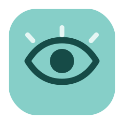
  </a>
</p>

<h1 align="center">Zdorovo</h1>

<p align="center">
  A calmer work rhythm for GNOME.<br>
  Guided health breaks, progressive training, breathing, habits and private screen-time analytics.
</p>

<p align="center">
  <a href="https://github.com/sichiiii/zdorovo/actions/workflows/test.yml"></a>
  <a href="https://github.com/sichiiii/zdorovo/releases/latest"></a>
  
  
  
</p>

<p align="center">
  <a href="#why-zdorovo">Why Zdorovo</a> ·
  <a href="#inside-the-app">Screenshots</a> ·
  <a href="#install">Install</a> ·
  <a href="#privacy-by-design">Privacy</a> ·
  <a href="#development">Development</a>
</p>

<p align="center">
  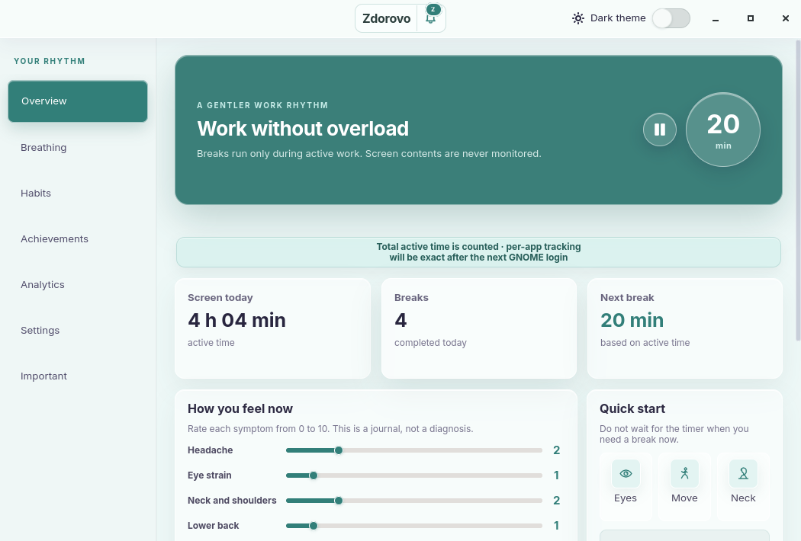
</p>

Zdorovo notices active computer work and schedules short, configurable pauses.
It can guide an exercise step by step, count the time for you, postpone a
reminder, pause media, and stay out of the way while your screen is being
shared. Everything is stored locally.

## Why Zdorovo

Most break timers stop at “stand up now.” Zdorovo connects the rest of the
workflow:

| | |
|---|---|
| **Useful pauses** | Rotating routines for eye rest, movement, neck and shoulders, lower back, hands and breathing. |
| **Courses with recovery built in** | Five distinct plans for full-body strength, arms/shoulders/back, leg strength, leg stability, and mobility/balance. Choose 7, 30, 180 or 360 days and exact weekdays; every session stays in the room and needs at most a wall, stable chair or yoga mat. |
| **Active-work timing** | Reminder clocks advance while you use the computer; fullscreen viewing remains counted even when the pointer is still. |
| **Guidance that finishes the job** | Each routine can include illustrated steps, a visible timer, progress and sound cues. |
| **Quiet when it matters** | Screen sharing, fullscreen activity and manual pause can suppress interruptions without stopping screen-time statistics. |
| **A local health journal** | Daily wellbeing check-ins can be compared with screen time and completed breaks. |
| **Progress without pressure** | Healthy habits and 56 emblems across seven eight-level achievement series. |

## Inside the app

<table>
  <tr>
    <td width="50%">
      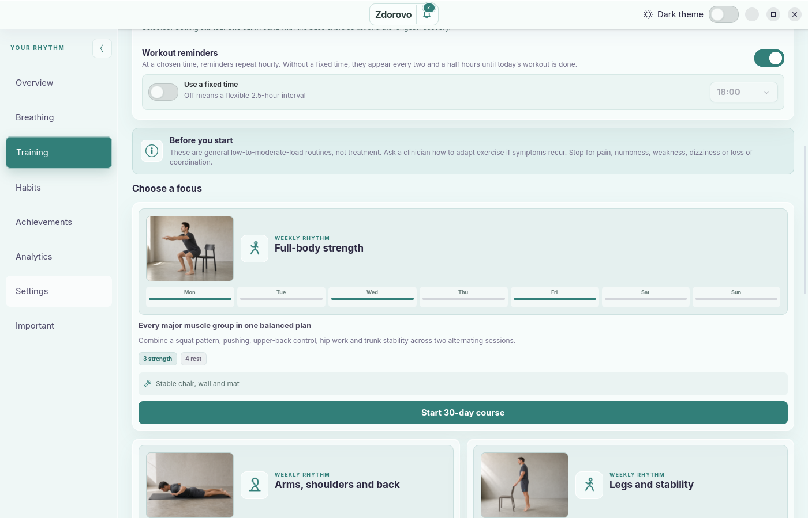
      <p align="center"><strong>Choose a sustainable course</strong><br><sub>Pick two to five exact weekdays, then match the workload to your recent training experience.</sub></p>
    </td>
    <td width="50%">
      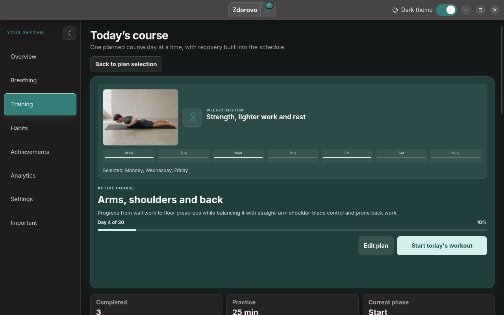
      <p align="center"><strong>One planned day at a time</strong><br><sub>Start directly from the active plan; course history, recovery days and a month calendar keep longer plans understandable.</sub></p>
    </td>
  </tr>
  <tr>
    <td colspan="2">
      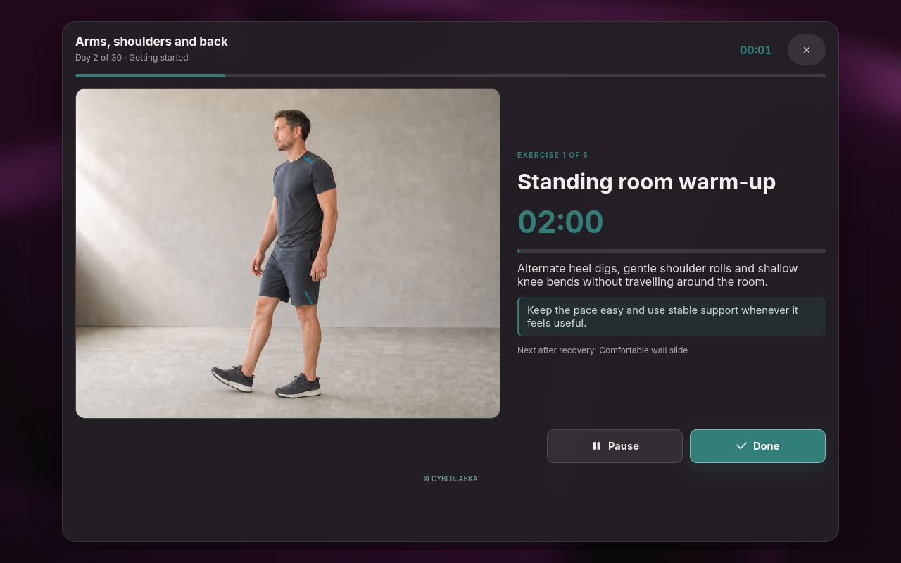
      <p align="center"><strong>Follow the session, not the clock</strong><br><sub>Timed exercises and recovery start automatically; repetition-based exercises wait for confirmation.</sub></p>
    </td>
  </tr>
  <tr>
    <td colspan="2">
      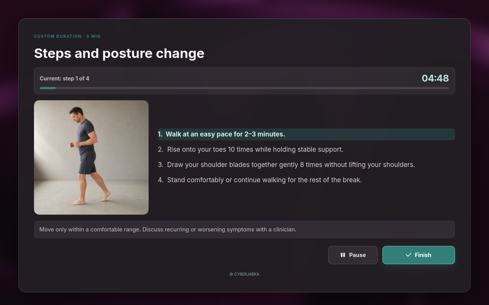
      <p align="center"><strong>A break that guides itself</strong><br><sub>Photos, a visible countdown, timed steps and sound cues keep the routine moving without watching the clock.</sub></p>
    </td>
  </tr>
  <tr>
    <td width="50%">
      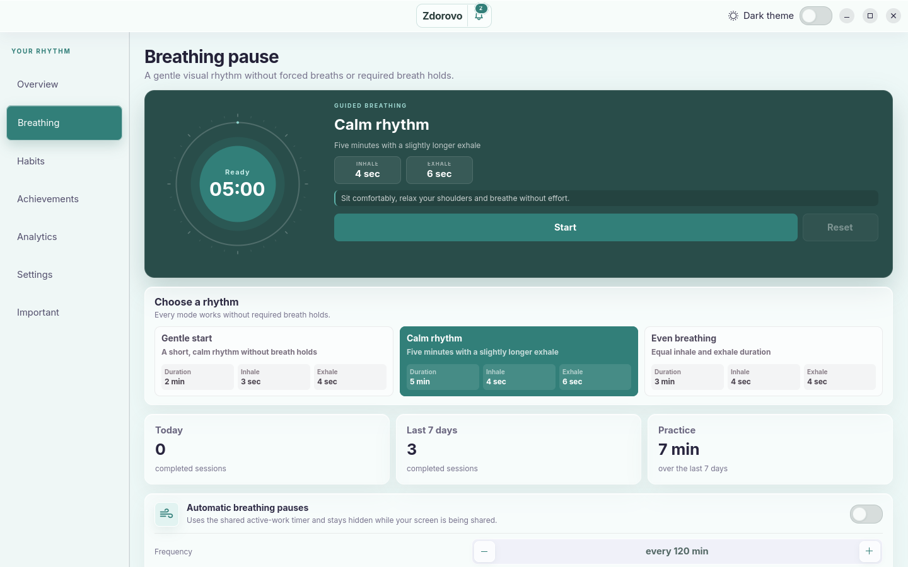
      <p align="center"><strong>Guided breathing</strong><br><sub>Three gentle rhythms with visual pacing and no required breath holds.</sub></p>
    </td>
    <td width="50%">
      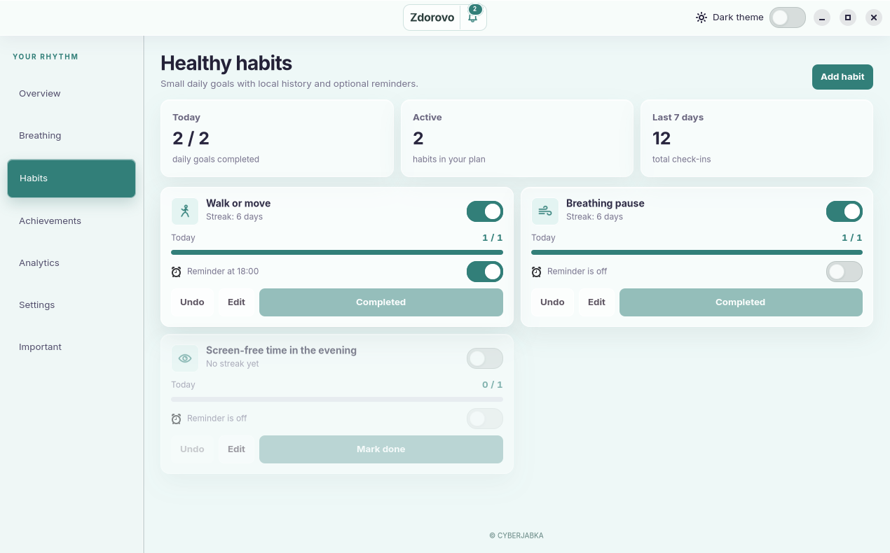
      <p align="center"><strong>Healthy habits</strong><br><sub>Small daily goals, streaks and optional reminders.</sub></p>
    </td>
  </tr>
  <tr>
    <td width="50%">
      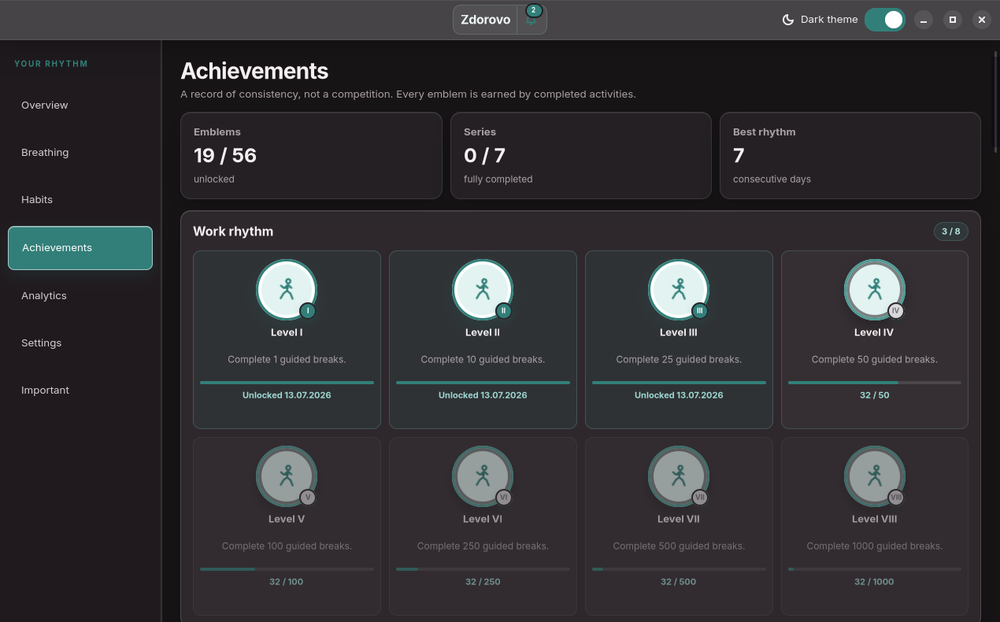
      <p align="center"><strong>Multi-level achievements</strong><br><sub>Persistent emblems earned from completed activities, not arbitrary points.</sub></p>
    </td>
    <td width="50%">
      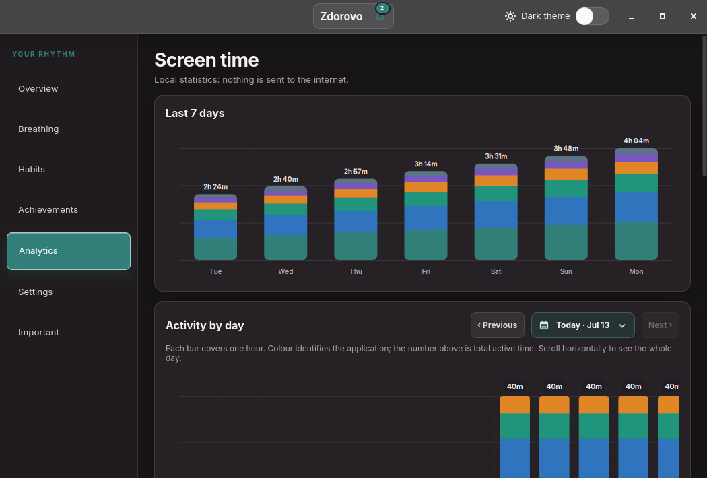
      <p align="center"><strong>Screen-time analytics</strong><br><sub>Weekly totals and an hourly application breakdown for any selected day.</sub></p>
    </td>
  </tr>
  <tr>
    <td width="50%">
      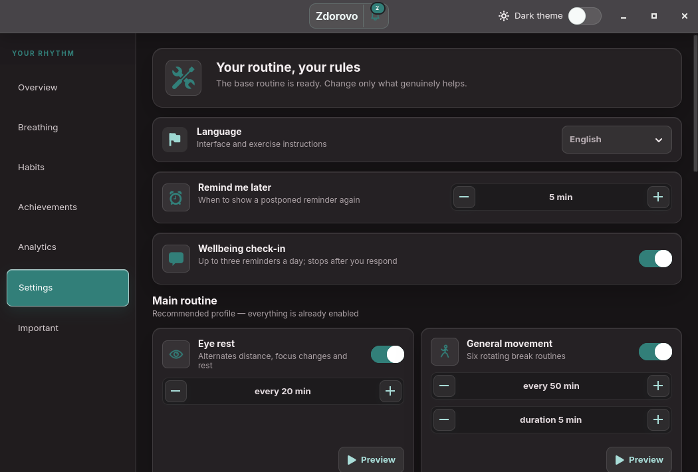
      <p align="center"><strong>Your routine, your rules</strong><br><sub>Every activity can be tuned independently, with three accent palettes and light, dark or scheduled appearance.</sub></p>
    </td>
    <td width="50%">
      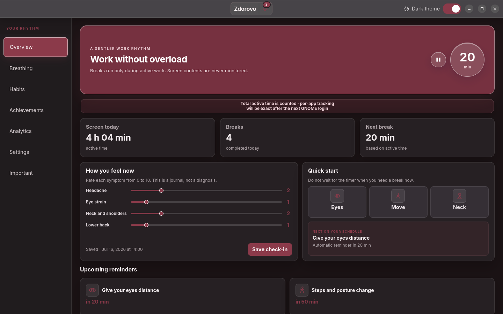
      <p align="center"><strong>Made to fit the desktop</strong><br><sub>Teal, burgundy and gray accents each work in light and dark mode.</sub></p>
    </td>
  </tr>
</table>

The screenshots are generated from a disposable demo profile. No personal
usage or wellbeing data is included in this repository.

## What it tracks

Zdorovo records the minimum needed to build useful statistics:

- active seconds per application;
- timestamps and outcomes of reminders;
- guided exercise duration;
- training-course settings, calendar progress and recorded session time;
- habit check-ins and unlocked achievements;
- wellbeing values entered by the user.

It does **not** record window titles, URLs, document contents, keystrokes or
screenshots.

## Install

### Debian package

Download the current package from
[GitHub Releases](https://github.com/sichiiii/zdorovo/releases/latest), then run:

```bash
sudo apt install ./zdorovo_0.1.7_all.deb
```

Open **Zdorovo** from the application list. Its user services start with the
GNOME session and keep timers running when the window is closed.

### From source

On Ubuntu 24.04 or newer:

```bash
sudo apt install \
  python3-gi python3-gi-cairo python3-cairo \
  gir1.2-gtk-4.0 gir1.2-adw-1 gir1.2-atspi-2.0 \
  gir1.2-gtk-3.0 gir1.2-ayatanaappindicator3-0.1 \
  gir1.2-graphene-1.0 at-spi2-core libglib2.0-bin

./install.sh
```

The source installer writes to `~/.local` and does not need root access.

## Desktop integration

Zdorovo consists of three small pieces:

```text
GNOME extension ── active app / idle / screen-share state ──┐
                                                            ├─ Zdorovo GTK app
Panel indicator ── open / pause / settings / exit actions ──┘
```

The GTK application owns the scheduler and SQLite database. A small GNOME
extension provides accurate active-application attribution on Wayland, while
the Ayatana indicator exposes background controls in the top panel.

System notifications include their full event text and open the relevant page
inside Zdorovo. The in-app notification centre keeps the same history locally.

## Compatibility

| Environment | Status |
|---|---|
| Ubuntu 24.04 LTS and newer | Primary target; package and GUI smoke-tested |
| Debian 13 | Package and GUI smoke-tested |
| GNOME 46–50 | Extension metadata and integration supported |
| Wayland | Accurate per-app tracking through the GNOME extension |
| X11 | AT-SPI fallback; the extension remains optional |

Other GNOME distributions can run the source installation when the required
GTK, libadwaita, AT-SPI and Ayatana AppIndicator bindings are available.

## Privacy by design

All runtime data stays in the user's home directory:

| Data | Location |
|---|---|
| Settings | `~/.config/zdorovo/config.json` |
| Analytics and achievements | `~/.local/share/zdorovo/usage.sqlite3` |
| Scheduler state | `~/.local/share/zdorovo/scheduler-state.json` |

The application has no account system, telemetry endpoint or cloud service.
Settings, analytics, training progress and achievements can be exported to one
JSON backup and restored on another computer.

## Development

```bash
python3 -m unittest discover -s tests -v
ruff check .
ruff format --check .
```

Build the Debian package with:

```bash
./scripts/build-deb.sh
```

Project internals are documented in
[Architecture](docs/ARCHITECTURE.md). Installation and desktop-integration
issues are covered in [Troubleshooting](docs/TROUBLESHOOTING.md).

## Uninstall

For a Debian installation:

```bash
sudo apt remove zdorovo
```

For a source installation:

```bash
./uninstall.sh
```

Settings and analytics are kept by default. Remove `~/.config/zdorovo` and
`~/.local/share/zdorovo` manually only if you also want to delete local history.

## Health note

Zdorovo is a work-rhythm tool, not a medical device. Stop an activity if it
causes discomfort. Recurring, unusual or worsening symptoms are best discussed
with a qualified clinician.

<p align="center">
  <sub><a href="https://cyberjabka.by/">© CYBERJABKA</a></sub>
</p>
